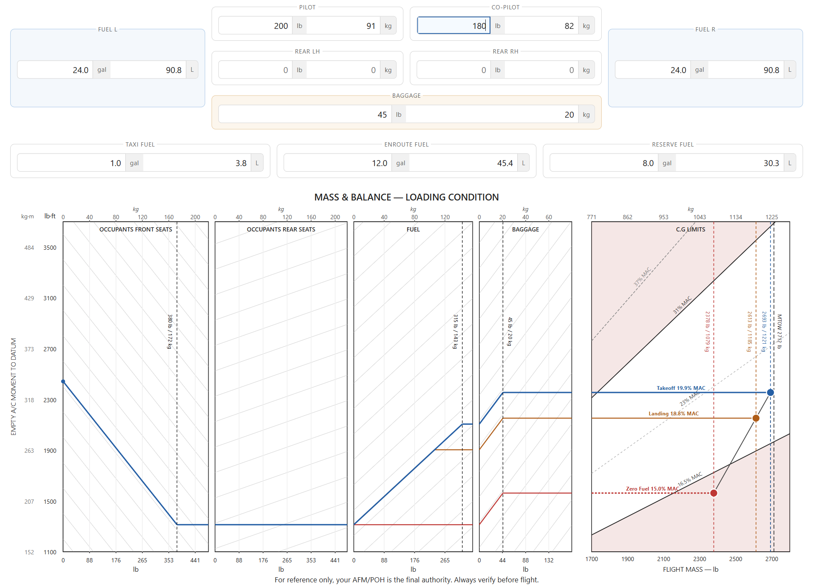

# Tecnam P2006T Weight & Balance Calculator

A browser-based weight and balance calculator for the Tecnam P2006T twin, built with vanilla JS and no bundler dependency. The Tecnam POH works in metric, but this calculator speaks "freedom units" 🇺🇸😄, so it handles all the kg/lb, L/gal, and kg·m/lb·ft conversions so you don't have to.

**[Run it now on GitHub Pages](https://lrixford.github.io/tecnam-p2006t)**



## Features

- **Loading condition table** with ramp, takeoff, landing, and zero-fuel weights with CG arm and % MAC
- **SVG nomograph** showing the CG envelope with a live trajectory dot for each loading condition
- **W&B suggestion engine** that automatically suggests fuel adjustments (and baggage additions when necessary) to bring an out-of-limits load into the envelope
- **Editable MTOW** to support modified aircraft with different maximum gross weights
- **Reserve fuel input** for configurable minimum landing fuel used by the suggestion engine
- **Print view** with a landscape-optimized layout with all four condition tables side by side
- **Mobile responsive** with a breakpoint at 1024 px; interior layout reorders for narrow screens
- **Persistent state** with last-entered values restored from `localStorage` on reload

## Aircraft Data

Arms, envelope limits, fuel density, and tank capacities are defined in `src/data/p2006t.js`.

### Fuel Density

This calculator uses **6.7 lb/gal (0.803 kg/L)** as specified in the Tecnam P2006T POH §6 W&B form. Note that the FAA standard planning weight is 6.01 lb/gal; the POH value is used here because it reflects the actual fuel (Avgas 100LL) density assumed in the certified weight and balance data.

To change the fuel density, update the single constant in `src/data/p2006t.js`:

```js
fuel: {
  density_lb_per_gal: 6.7,   // change this value
  ...
}
```

All fuel weight calculations throughout the app derive from this one value.

## Adding to a Website

No build step or dependencies required. Copy the repository files to your web server and embed the widget with a single script tag:

```html
<!-- Place this where you want the calculator to appear -->
<div id="wb-root"></div>

<script type="module">
  import { mountWidget } from './src/tecnam-p2006t-widget.js';
  mountWidget(document.getElementById('wb-root'));
</script>
```

The calculator uses ES modules, so files must be served over HTTP/HTTPS. It will not work opened directly as a `file://` URL.

Styles are self-contained in `src/styles.css`. Link it in your page `<head>` or import it alongside your own stylesheet:

```html
<link rel="stylesheet" href="src/styles.css">
```

## Running Tests

Requires Node.js 22 or later (built-in test runner).

```bash
npm test
```

Tests cover the calculation engine (`loadingCondition.js`) and the suggestion engine (`suggest.js`), including apply-and-recheck round-trips, edge cases, and precision constraints.

## Tech Stack

| Concern | Solution |
|---|---|
| Language | Vanilla JS (ES modules) |
| Styling | Plain CSS with `light-dark()` color scheme support |
| Charts | Inline SVG, drawn programmatically |
| Tests | Node.js built-in test runner (`node:test`) |
| Serving | `npx serve` (dev only) |

## Project Structure

```
src/
  data/p2006t.js          aircraft constants (arms, envelope, fuel)
  loadingCondition.js     pure W&B calculation engine
  suggest.js              fuel/baggage suggestion engine
  nomograph.js            SVG envelope chart builder
  stationInput.js         input form component
  dataTable.js            loading condition table component
  tecnam-p2006t-widget.js top-level component
  styles.css
tests/
  loadingCondition.test.js
  suggest.test.js
  ...
index.html
```

## Disclaimer

This tool is for **planning and reference purposes only**. All weight and balance calculations must be verified against the official Aircraft Flight Manual (AFM) and Pilot's Operating Handbook (POH) before flight. The pilot in command is responsible for ensuring the aircraft is loaded within approved limits.
